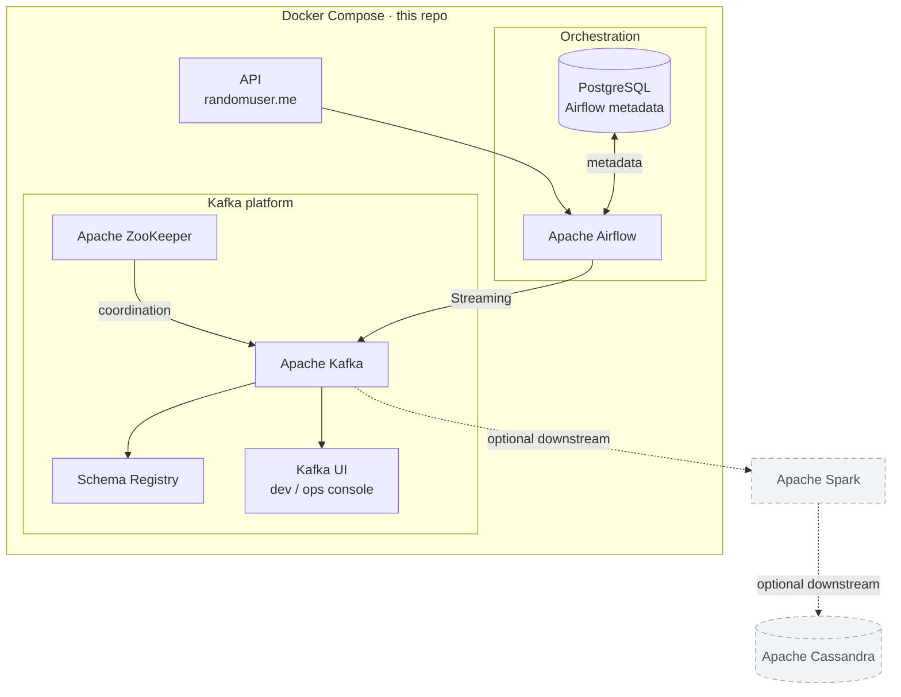

# Kafka Random User API

Sample pipeline that **fetches a profile from [randomuser.me](https://randomuser.me)**, **registers an Avro schema** in Confluent Schema Registry, and **produces serialized records** to a Kafka topic. Optional **Apache Airflow** orchestration runs the same steps as a DAG.

---

## Architecture

Classic **streaming-style** layout: data enters from an **API**, **Airflow** orchestrates and **streams** into **Kafka**; **ZooKeeper** coordinates Kafka; **Schema Registry** and a **control UI** sit on the Kafka side. Your DAG’s **producer** runs inside Airflow and uses Schema Registry + the Kafka broker.

Everything below is brought up with **Docker Compose** (same idea as the diagram you’d draw on a whiteboard).



**How this maps to `docker-compose.yaml`**

| Diagram | Compose service |
|--------|-------------------|
| API | External (`randomuser.me`), not a container |
| Apache Airflow | `airflow-webserver`, `airflow-scheduler` |
| PostgreSQL | `postgres` |
| Apache ZooKeeper | `zookeeper` |
| Apache Kafka | `kafka` |
| Schema Registry | `schema-registry` |
| Kafka UI | `kafka-ui` (plays the “monitor / console” role, similar to Confluent Control Center in larger stacks) |

**What runs in code**

| Step | What happens |
|------|----------------|
| **API → Airflow** | DAG task calls the HTTP API and formats JSON. |
| **Airflow ↔ Postgres** | Airflow stores DAG runs, task state, and metadata (not your business payloads). |
| **Streaming (Airflow → Kafka)** | Tasks register Avro schemas and the **producer** writes to topic `random-users-info`. |
| **Kafka platform** | ZooKeeper backs Kafka; Schema Registry stores `.avsc`; Kafka UI is for browsing topics. |

**Spark and Cassandra** in the diagram are a common *next* stage (stream processing → wide-column store). **They are not defined in this repository** — the dashed arrows are only to show how the pattern extends. This project stops at **Kafka + Schema Registry** and the **Python producer**.

---

## Repository layout

```
kafka-random-user-api/
├── config/settings.py          # Broker, Schema Registry URL, topic → schema paths
├── producer/                   # Avro producer, topic admin, validation
├── schema/
│   ├── register_client/        # Registry registration helpers
│   └── schema_registry/        # *.avsc Avro definitions
├── dags/                       # Airflow DAG files (mounted into containers)
├── logs/                       # Airflow task & scheduler logs (mounted)
├── plugins/                    # Airflow plugins (optional)
├── local_main.py               # CLI entrypoint without Airflow
├── Dockerfile                  # Airflow image: deps from requirements.txt
├── docker-compose.yaml         # Kafka + Schema Registry + Airflow + Postgres
├── requirements.txt
└── pyproject.toml              # Poetry metadata
```

---

## Airflow folders: `dags`, `logs`, `plugins`

Compose expects these directories on the host so volumes mount cleanly. Create them once from the project root:

```bash
mkdir -p dags logs plugins
```

- **`dags/`** — Python files that define DAGs (e.g. `kafka_user_producer_dag.py`).
- **`logs/`** — Written by the scheduler and task processes; useful for debugging.
- **`plugins/`** — Custom Airflow plugins (can stay empty).

---

## Run with Docker

### Prerequisites

- [Docker](https://docs.docker.com/get-docker/) and Docker Compose

### Build and start the full stack

From the project root:

```bash
mkdir -p dags logs plugins
docker compose build
docker compose up -d
```

### Service URLs (host machine)

| Service | URL |
|---------|-----|
| **Airflow UI** | http://localhost:8085 (container port `8080` mapped to `8085`) |
| **Kafka UI** | http://localhost:8080 |
| **Schema Registry** | http://localhost:8081 |

Default Airflow user (from `docker-compose.yaml`):

- **Username:** `admin`
- **Password:** `admin`

Airflow containers use **`PYTHONPATH=/opt/airflow/kafka-random-user-api`** so `config`, `producer`, and `schema` import correctly. The project tree is mounted at `/opt/airflow/kafka-random-user-api`.

### Kafka / Schema Registry from inside Docker

For tasks running **inside** Airflow containers, `config/settings.py` should use **Docker DNS names**, not `localhost`:

- `KAFKA_BROKER=kafka:29092`
- `SCHEMA_REGISTRY_URL=http://schema-registry:8081`

(Adjust if you change listener names in Compose.)

### Stop

```bash
docker compose down
```

---

## Run locally (without Airflow)

Use this when you only want to run the producer script on your machine against Kafka started by Compose.

### 1. Start Kafka and Schema Registry

```bash
docker compose up -d zookeeper kafka schema-registry
```


### 2. Point config at localhost

In `config/settings.py`, use the **localhost** listeners exposed on the host:

```python
KAFKA_BROKER = "localhost:9092"
SCHEMA_REGISTRY_URL = "http://localhost:8081"
```

Comment out or remove the `kafka:29092` / `schema-registry:8081` lines used for in-container Airflow.

### 3. Install dependencies and run

Using Poetry:

```bash
cd /path/to/kafka-random-user-api
poetry install
poetry run python local_main.py
```

Or with a virtualenv and `requirements.txt`:

```bash
python -m venv .venv
source .venv/bin/activate   # Windows: .venv\Scripts\activate
pip install -r requirements.txt
python local_main.py
```

**Note:** `confluent-kafka` may need build tools on some platforms; the provided **Dockerfile** installs `gcc` and `librdkafka-dev` for that reason.

---

## DAG overview

The DAG **`kafka_random_user_producer`** (`dags/kafka_user_producer_dag.py`):

1. **`fetch_and_format_user`** — Calls the API and pushes a dict to XCom.
2. **`register_schemas`** — Registers Avro schemas from `TOPIC_SCHEMA_MAP` via Schema Registry.
3. **`produce_to_kafka`** — Produces one record to topic `random-users-info`.

Task order: `fetch_and_format_user` → `register_schemas` → `produce_to_kafka`.

---

## Troubleshooting

| Issue | What to check |
|-------|----------------|
| `No module named 'confluent_kafka'` | Airflow image must be built from **`Dockerfile`** (`docker compose build`) so `requirements.txt` is installed. |
| Schema file not found | Paths are resolved from **`PROJECT_ROOT`** in `config/settings.py`; run from repo or rely on `PYTHONPATH` in Docker. |
| Cannot connect to Kafka from Airflow | Use **`kafka:29092`** (in-network) inside containers; use **`localhost:9092`** only from the host. |
| Cannot connect from host script | Use **`localhost:9092`** / **`http://localhost:8081`** when Kafka runs in Compose with published ports. |

---

## License

See your organization’s policy; add a `LICENSE` file if you open-source the repo.
